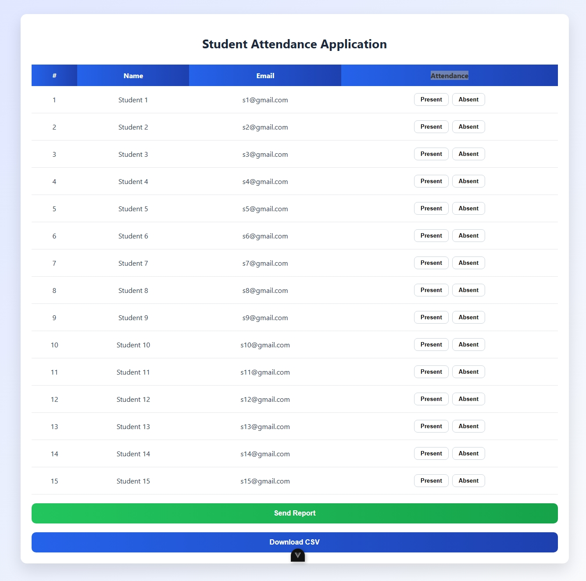
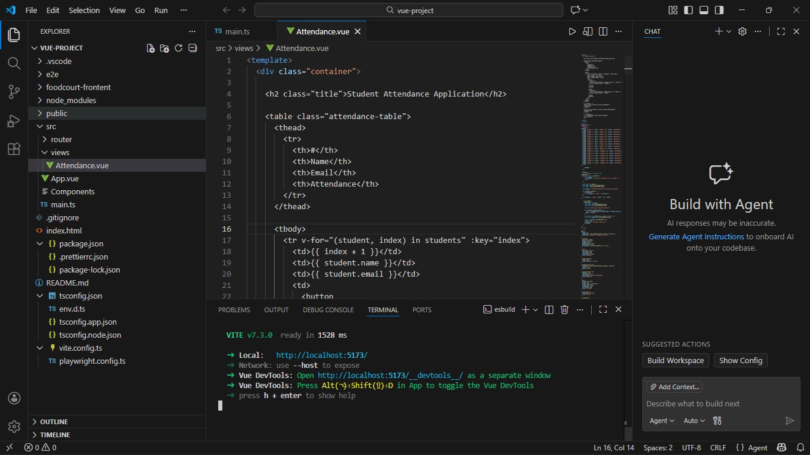

# vue-project

# Student Attendance Management System (Vue.js)

This template should help get you started developing with Vue 3 in Vite.

## Recommended IDE Setup

[VS Code](https://code.visualstudio.com/) + [Vue (Official)](https://marketplace.visualstudio.com/items?itemName=Vue.volar) (and disable Vetur).

## Recommended Browser Setup

- Chromium-based browsers (Chrome, Edge, Brave, etc.):
  - [Vue.js devtools](https://chromewebstore.google.com/detail/vuejs-devtools/nhdogjmejiglipccpnnnanhbledajbpd)
  - [Turn on Custom Object Formatter in Chrome DevTools](http://bit.ly/object-formatters)
- Firefox:
  - [Vue.js devtools](https://addons.mozilla.org/en-US/firefox/addon/vue-js-devtools/)
  - [Turn on Custom Object Formatter in Firefox DevTools](https://fxdx.dev/firefox-devtools-custom-object-formatters/)

## Type Support for `.vue` Imports in TS

TypeScript cannot handle type information for `.vue` imports by default, so we replace the `tsc` CLI with `vue-tsc` for type checking. In editors, we need [Volar](https://marketplace.visualstudio.com/items?itemName=Vue.volar) to make the TypeScript language service aware of `.vue` types.

## Customize configuration

See [Vite Configuration Reference](https://vite.dev/config/).

## Project Setup

```sh
npm install
```

### Compile and Hot-Reload for Development

```sh
npm run dev
```

### Type-Check, Compile and Minify for Production

```sh
npm run build
```

### Run End-to-End Tests with [Playwright](https://playwright.dev)

```sh
# Install browsers for the first run
npx playwright install

# When testing on CI, must build the project first
npm run build

# Runs the end-to-end tests
npm run test:e2e
# Runs the tests only on Chromium
npm run test:e2e -- --project=chromium
# Runs the tests of a specific file
npm run test:e2e -- tests/example.spec.ts
# Runs the tests in debug mode
npm run test:e2e -- --debug
```
# Attendance Project

Student Attendance Management System built using Vue.js.

## Project Screenshot
## Project Screenshot






## Features
- Mark student attendance
- View attendance records
- Simple user interface

## Tech Stack
- Vue.js
- HTML
- CSS
- JavaScript
